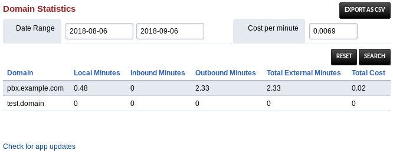

# Domain Statistics

Basic statistics about each domain, including inbound, internal & outbound calls over the last 30 days, average cost (adjustable by changing the per minute cost in index.php labeled $costpermin), and the ability to export all this data to a CSV so you can open it in your favorite spreadsheet software!



## Installation
This was written and tested with FusionPBX 4.5.1 (current master) and will likely work on newer or slightly older versions of FusionPBX.

Clone this into the working path after SSHing/Moshing into your server:

```
cd /var/www/fusionpbx/app
git clone https://git.callpipe.com/fusionpbx/domain-statistics.git
```

Then navigate to your FusionPBX install and choose Advanced => Upgrade, check Menu Defaults and Permission Defaults (Warning: choosing Permission Defaults may reset any custom permissions!) and press Execute.

At this point, Apps => Domain Statistics should appear after you log out and log back in. If you chose to skip Permission Defaults, prior to logging out you will need to go to Advanced => Group Manager and choose Permissions to the right of superadmin, then grant the 	domain_statistics permission, save, log out, and log back in.

## Notes about Permissions
Thanks to the FusionPBX permissions model, one can easily make a restricted accounting user that has very limited ability to break things or get lost in say gateway config or other users voicemail. One key thing to note is a user's permissions are set at login, so an end user must log out and back in after giving or removing a permission from their account for it to take effect.

## Things to improve
* Users should be able to have different prices for inbound/outbound, as they often cost different amounts
* Count of currently registered devices
* Count of current extensions
* Count of disk space used by voicemail/recordings/stored faxes
